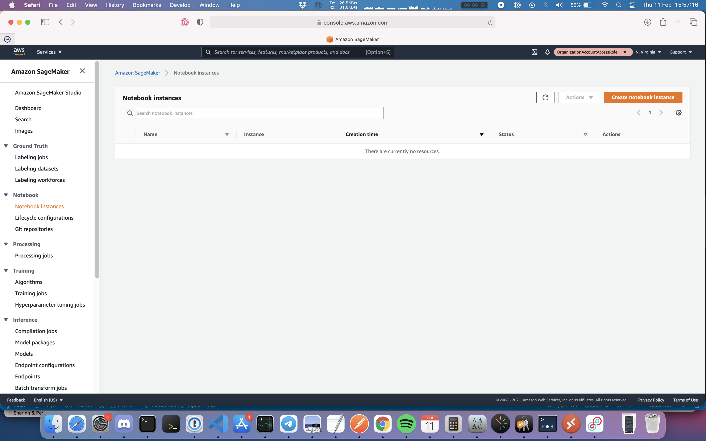
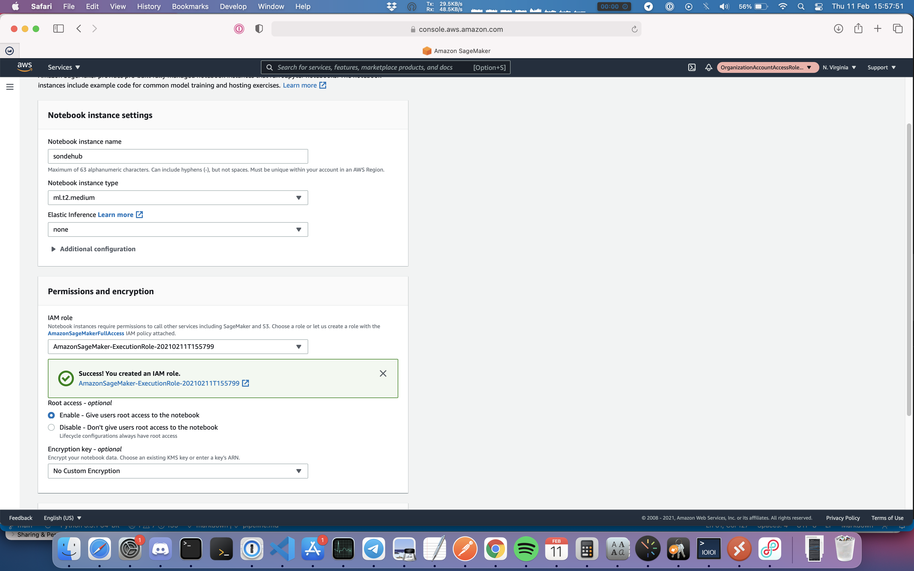
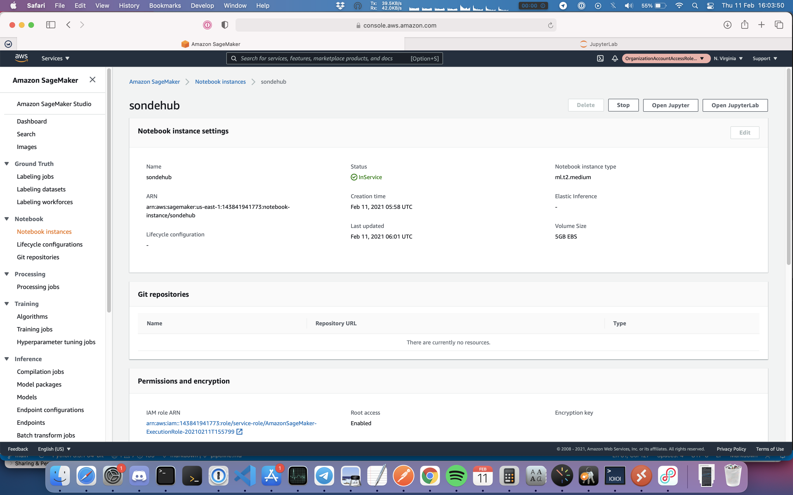
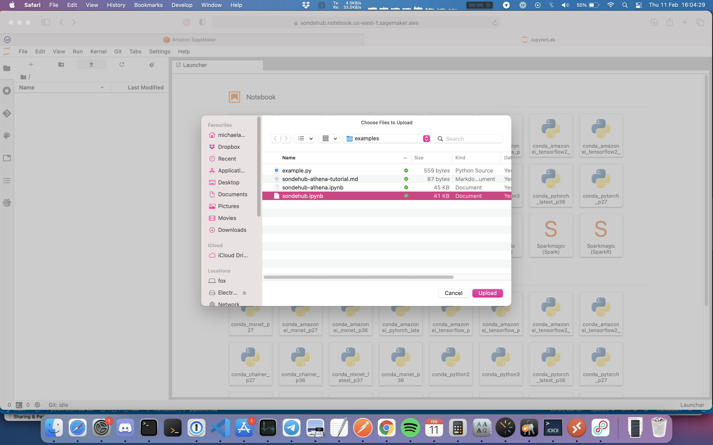
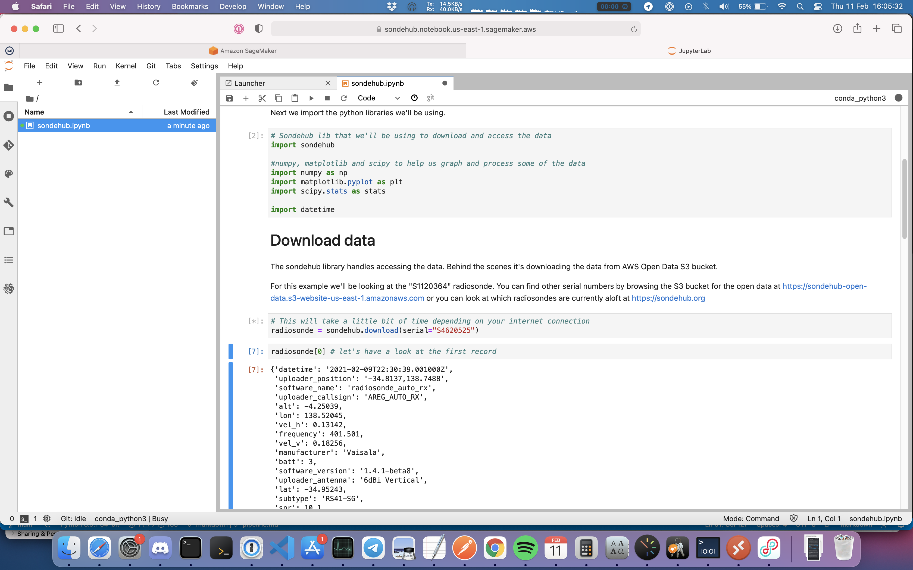
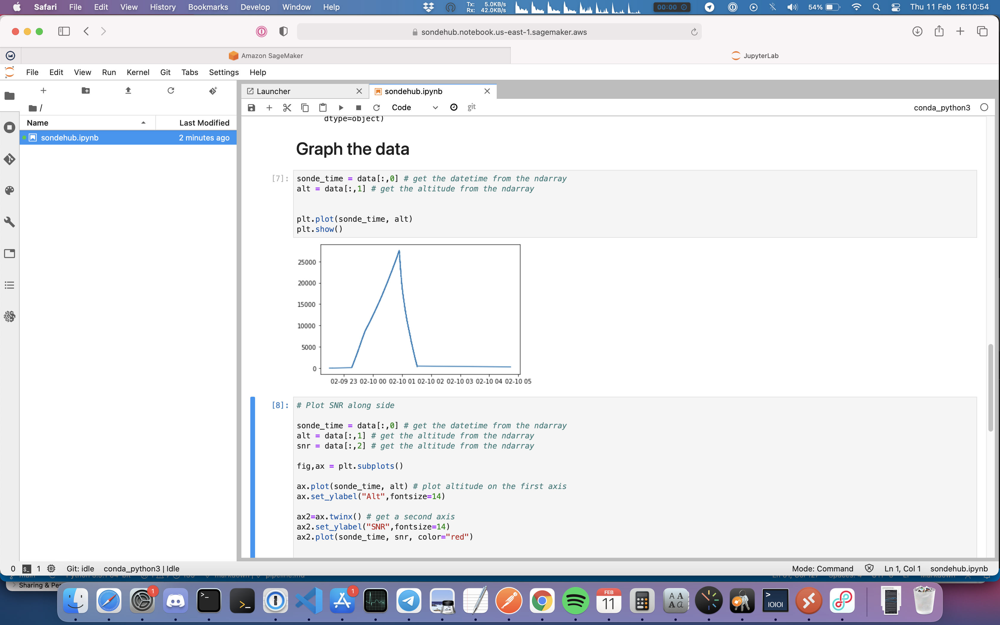

These example Jupyter notebook installs show how to access SondeHub open data.

Using Examples
==

This examples can be used with either SageMaker or a local Jupyter install. For ease getting starting these instructions demonstrate how to configure a SageMaker instances to start experimenting with the data.

> SageMaker free usage tier and pricing can be found [here](https://aws.amazon.com/sagemaker/pricing/)

1. Navigate to the SageMarker console, and open the "NoteBook instances" panel

   

2. Give the NoteBook an instance name. All other settings can be left as default

   

3. Wait for the instance to change from `Pending` to `In Service`

4. Click on the instance and click the `Open JupyterLab` button

   

5. Select the `Upload files` icon (up arrow with a line underneath) and upload the example you'd like to run

   
8. Double click the Notebook that was uploaded in the left directory explorer pane.

    

9. Follow the notebook from the top to the bottom. Click on each cell of code and press the `Run` button (represented by a right arrow) in the notebook

   
10. Once your finished analyzing data remember to shutdown or terminate your SageMaker instance